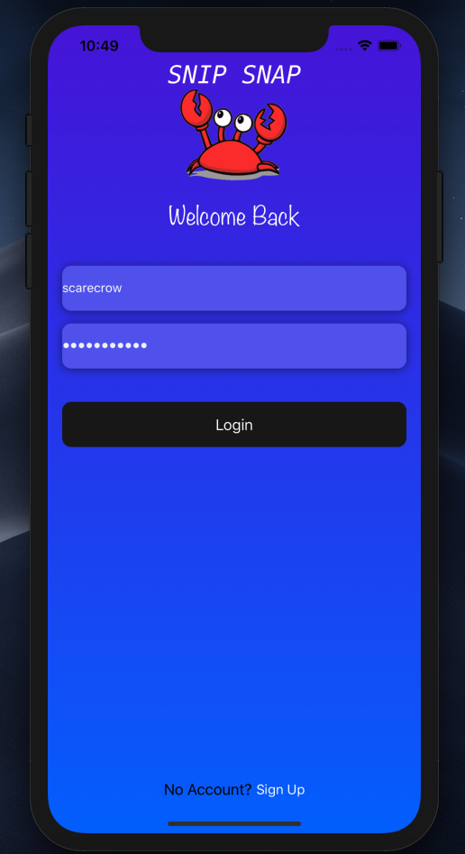

#  Thoughts on each Screen

I am using apollo iOS to connect to my golang graphql server that is running on aws. 
The golang graphql is using gqlgen and is connected to a postgreSQL database which is also on aws. 

The design of this application is not mine, it is from a design created on [dribble](https://dribbble.com/shots/11069254-Ciach-Ciach/attachments/2666293?mode=media). The login/register screen design and the map view design are mine. 

## Login 

The login screen is fairly straight forward the username and password textfields are used as the input 
to the graphql login mutation. 

- [ ] Display a message if the login was not successful. 

## Shops

First, I get the coordinates of one location (usually the location of the user)
then I fetch all the shops from the backend server and cache to data to be later used in the shopCards.

Second, I sort the shop data by distance by default then reload the tableview.

Last, I setup the tabbar at the bottom so that it displays which bar we are on.

- [ ] Connect the tabbar items to their respective screens.

 

